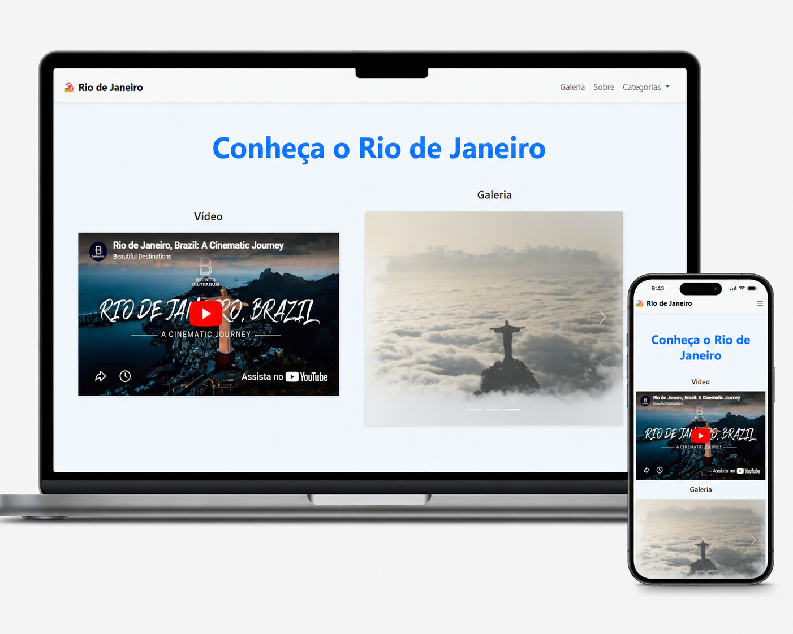

# 🏖️ Projeto Rio de Janeiro com Bootstrap

Projeto desenvolvido com **HTML5, CSS3 e Bootstrap**, apresentando uma página responsiva sobre o Rio de Janeiro, com vídeo, galeria em carrossel, cards informativos e rodapé.



## 🚀 Sobre o Projeto

O objetivo deste projeto foi praticar a construção de uma landing page responsiva utilizando o framework **Bootstrap**.

A página apresenta uma estrutura moderna, organizada e adaptável para diferentes tamanhos de tela, destacando as belezas naturais e culturais do Rio de Janeiro.

## 🛠️ Tecnologias Utilizadas

* HTML5
* CSS3
* Bootstrap 5
* YouTube Embed
* Responsividade com Bootstrap Grid

## 📌 Funcionalidades

* Navbar responsiva com menu dropdown
* Vídeo incorporado do YouTube
* Carrossel de imagens com indicadores e controles
* Cards informativos sobre praias, montanhas e cultura
* Footer com links e redes sociais
* Layout responsivo para desktop, tablet e celular

## 📱 Responsividade

O projeto utiliza o sistema de grid do Bootstrap, permitindo que os elementos se ajustem automaticamente em diferentes dispositivos.

No desktop, o vídeo e a galeria aparecem lado a lado.
No celular, os conteúdos são organizados em coluna, melhorando a experiência do usuário.

## 📂 Estrutura do Projeto

```bash
projeto-bootstrap/
│
├── index.html
├── imagens/
│   ├── praia.jpg
│   ├── imagem 1.jpg
│   └── cristo.jpg
└── README.md
```

## ▶️ Como Executar

1. Baixe ou clone este repositório.
2. Abra o arquivo `index.html` no navegador.
3. Pronto! O projeto será exibido localmente.

## 👨‍💻 Autor

Desenvolvido por **Douglas Faria**.

## 📄 Licença

Este projeto foi desenvolvido para fins de estudo e prática com Bootstrap.

